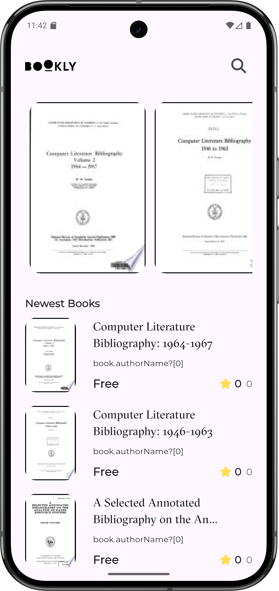
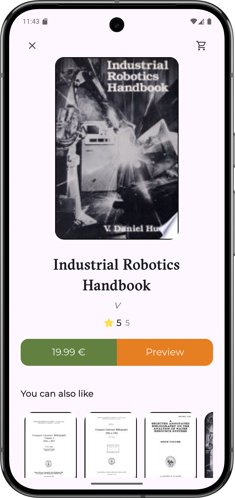
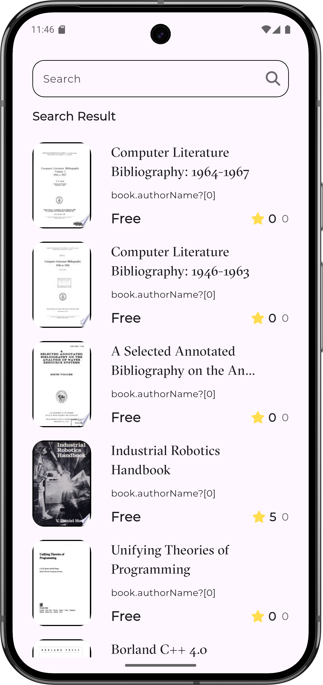

# 📚 Bookly App

### Production-Ready Flutter App | Clean Architecture | BLoC

> A scalable and maintainable Flutter application built using Clean Architecture and BLoC.
> This project demonstrates real-world Flutter development practices suitable for production and hiring evaluation.

---

## 👀 Why This Project

This project showcases my ability to:

- Build production-ready Flutter applications
- Apply Clean Architecture principles
- Use BLoC for predictable state management
- Structure large-scale Flutter projects
- Handle API integration and local caching
- Write clean, maintainable, and testable code

---

## 🚀 App Preview

> Replace these images with real screenshots from the app

  
  
  

---

## ✨ Features

- Browse featured and newest books
- Search for books using remote API
- Clean and modern UI
- Shimmer loading effects
- Offline caching with Hive
- BLoC-based state management
- REST API integration
- Clean Architecture implementation

---

## 🧠 Architecture Overview

This project follows **Uncle Bob’s Clean Architecture**, ensuring separation of concerns and scalability.

### Layers

#### Presentation Layer

- Flutter UI (Screens & Widgets)
- BLoC (Events & States)
- Handles user interactions

#### Domain Layer

- Business logic (Use Cases)
- Entities
- Repository contracts

#### Data Layer

- Remote data source (Dio)
- Local data source (Hive)
- Models and repository implementations

---

## 🛠️ Tech Stack

| Category               | Technology         |
| ---------------------- | ------------------ |
| Framework              | Flutter            |
| Language               | Dart               |
| Architecture           | Clean Architecture |
| State Management       | BLoC               |
| Networking             | Dio                |
| Local Storage          | Hive               |
| Dependency Injection   | GetIt              |
| Functional Programming | Dartz              |
| Navigation             | GoRouter           |
